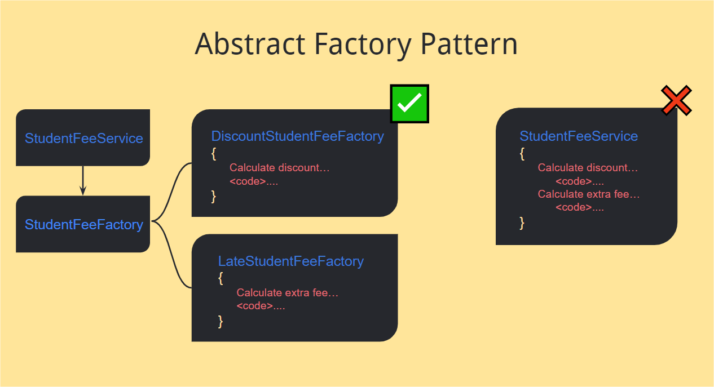

## Student Fees API

Here, we will create an ASP.NET Core minimal API that is responsible for registering student fees implementing Abstract Factory pattern (Creational Patterns).

## Running

`dotnet run`

Access in the browser => `http://localhost:<port>/swagger/index.html`
